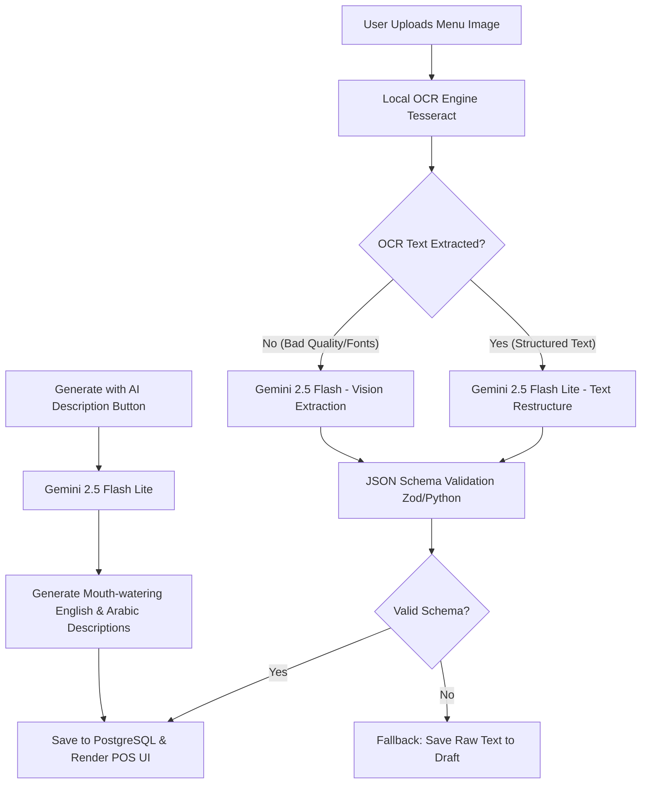

# Technical Case Study: AI-Powered Menu Engineering Pipeline (MenuFlowX SaaS)

This document serves as the technical showcase of an AI-integrated production project for your portfolio submission.

---

## 1. Project Overview: MenuFlowX (Restaurant Growth OS)
**MenuFlowX** is a modern, high-performance multi-tenant SaaS platform built to streamline restaurant operations. It features:
*   **High-Speed POS System:** A custom cashier dashboard optimized for keyboard shortcuts, offline resilience, and dual-printing (Customer Receipts & Kitchen Tickets).
*   **Digital QR Menus:** Multi-language, responsive digital menus supporting contactless customer ordering.
*   **Real-time Order Management:** Live dashboards leveraging WebSockets for instantaneous kitchen and cashier synchronization.
*   **Billing & Subscriptions:** Paymob payment gateway integration with automated monthly/annual billing.
*   **AI-Powered Menu Engineering:** A hybrid Local-Cloud AI pipeline utilizing **Google Gemini AI** models to automatically digitize physical menus (OCR) and generate compelling, bilingual item descriptions.

*   **GitHub Repository:** [github.com/kareemelbalshe/MenuFlowX](https://github.com/kareemelbalshe/MenuFlowX)
*   **Tech Stack:** Next.js 14 (App Router), Node.js (Express & TypeScript), PostgreSQL (Prisma), Redis (BullMQ queues), Socket.io, Tesseract/Playwright, and Google Gemini API.

---

## 2. The AI Integration: Hybrid OCR & Gemini Structure Pipeline
When restaurant owners migrate to MenuFlowX, they can digitize their existing paper menus by uploading a photo. Rather than running slow, expensive cloud Vision requests for every pixel, MenuFlowX uses a highly optimized, dual-layer hybrid pipeline.

### Core Architecture & Execution Flow
1.  **Local OCR (First Line of Defense):** The system first processes the uploaded menu image locally using Tesseract OCR. This extracts raw coordinates and word lists at virtually zero cost and low latency.
2.  **Gemini Text Restructuring (Rescue Layer - `gemini-2.5-flash-lite`):** If the local OCR succeeds in extracting raw text but lacks categorization or structure (e.g. differentiating sections like "Appetizers" and "Main Course"), the backend passes this raw text to `gemini-2.5-flash-lite`. Gemini analyzes the relationships, assigns logical categories, formats the prices, and outputs structured JSON matching the database schema.
3.  **Gemini Vision Extraction (Last Resort - `gemini-2.5-flash`):** If local OCR fails (due to poor image quality, stylized fonts, or low contrast), the system triggers the Gemini Vision model. It uploads the image directly to Gemini, asking it to inspect the physical menu and output the structured JSON directly.
4.  **Bilingual AI Generation:** Pro users can click **"Generate with AI"** on any menu item. The system feeds the item name and cuisine style to the Gemini API, returning mouth-watering, localized descriptions in both **English and Arabic** simultaneously.

### System Architecture Flow (Mermaid)



---

## 3. Production Safeguards & Engineering Best Practices

### A. Strict Schema & Validation Guarantees
AI models can hallucinate or output malformed JSON. MenuFlowX prevents this by passing a strict JSON Schema Hint to the Gemini API. In `parse_menu.py`, the prompt enforces:
```json
{
  "categories": [
    {
      "name": "Category Name (e.g. Pizzas)",
      "items": [
        { "name": "Item Name", "price": 99.99, "description": "Details..." }
      ]
    }
  ]
}
```
All outputs are validated on the backend via a Zod schema before hitting the Prisma database client, preventing database corruption or application crashes.

### B. Intelligent Rate Limiting & Cost Management
To protect the restaurant owner from high API bills and avoid Google Cloud rate limits, the system features a file-backed `GeminiRateLimiter`.
*   **Daily Quota Cap:** Restricts total daily calls (default: 60 calls/day).
*   **Minute Quota Cap:** Limits burst calls (default: 8 calls/minute).
*   **Graceful Degradation:** If the rate limit is hit, the application gracefully alerts the user and falls back to a clean manual input form, ensuring zero downtime.

---

## 4. Why This Project is a Strong Showcase
1.  **Practical & High-Value:** Solves a major onboarding bottleneck for restaurant owners (typing out hundreds of menu items by hand).
2.  **Hybrid Approach:** Demonstrates engineering pragmatism by prioritizing free local OCR and only invoking paid Cloud LLMs when necessary.
3.  **Cost-Conscious AI:** Utilizes `gemini-2.5-flash-lite` for text-based tasks to reduce latency and cost by over 70% compared to standard models.
4.  **Enterprise Readiness:** The AI is not just a demo; it is integrated into a multi-tenant POS SaaS with secure JWT cookies, real-time WebSockets, and background workers (BullMQ) for automatic cleanup.
